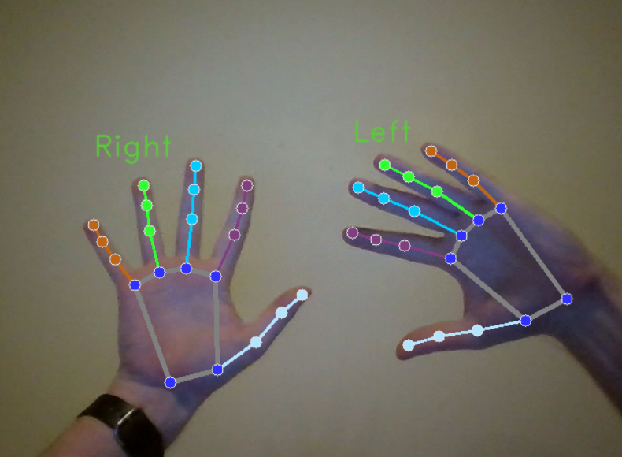

# Hand Tracking (MediaPipe + OpenCV)

Real-time hand tracking and annotation using a webcam. The script uses MediaPipe Tasks API for landmark detection, OpenCV for video capture/display, and NumPy for image processing.

## Features
- Real-time hand landmark detection (up to 2 hands)
- Handedness labeling (Left / Right)
- Live video annotation overlay

## Example

Example of real-time output (mirored webcam view):



## Requirements

- Python 3.9+ (required for MediaPipe Tasks API compatibility)
- Webcam (built-in or external)

## Installation

Install dependencies:

```bash
pip install -r requirements.txt
```

Or manually:

```bash
pip install mediapipe opencv-python numpy
```

## Model File

This repository already includes the required model file:
- `hand_landmarker.task`

If you want to download the latest version manually, use the official MediaPipe model page:
[https://ai.google.dev/edge/mediapipe/solutions/vision/hand_landmarker/index#models](https://ai.google.dev/edge/mediapipe/solutions/vision/hand_landmarker/index#models)

## Run

```bash
python hand-track.py
```

## Controls

- ESC: Exit the application.